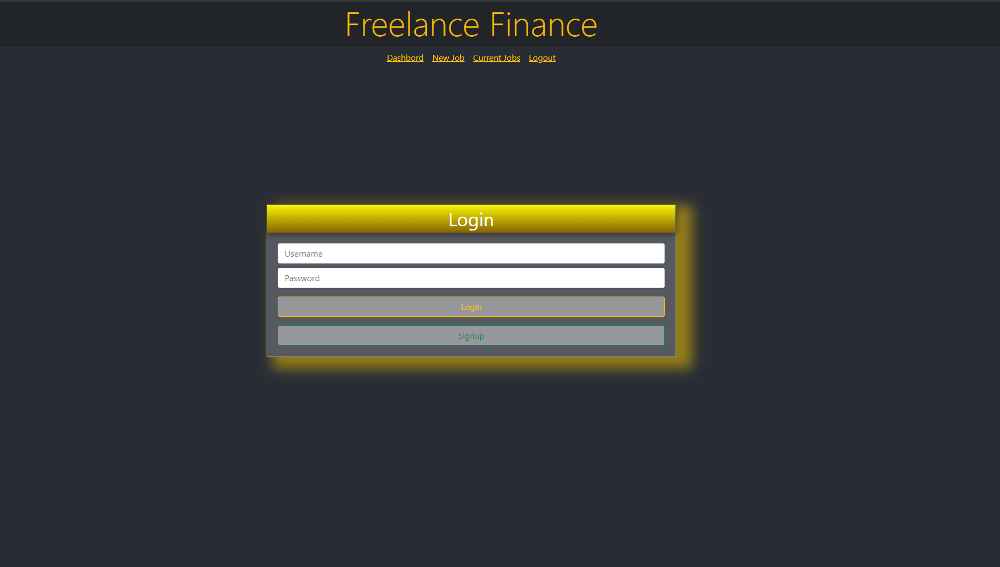
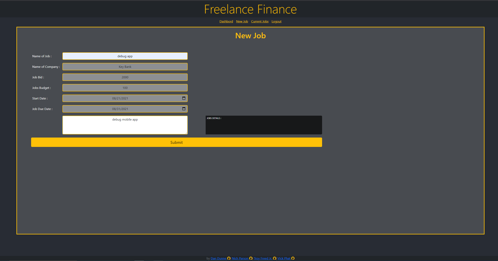
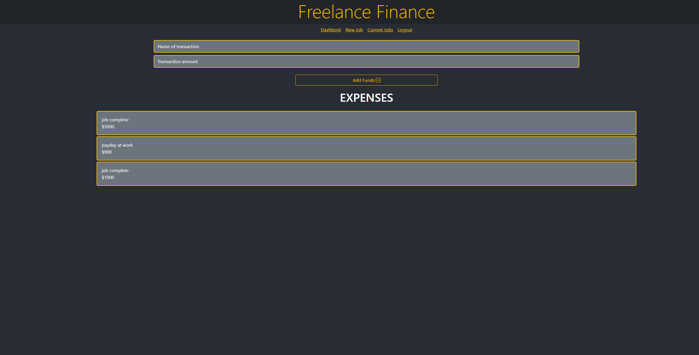
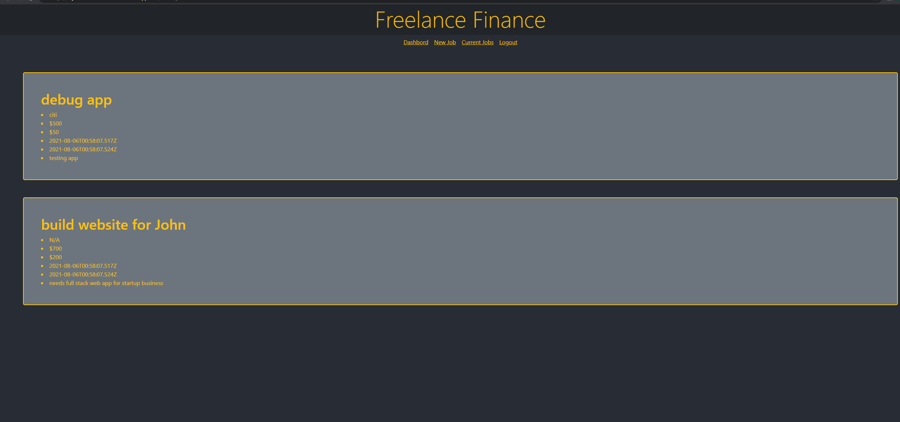

# Freelance Finance
 This project is covered by the ISC license
# Table of Contents
1. [Screenshots](#Screenshots) 
2. [Project Description](#description)
3. [Installation Process](#installation)
4. [Usage](#usage)
5. [Contributors](#contribution)
6. [License Coverage](#license)
7. [Questions](#questions)
## Screenshots:

## Description: 
This project was designed around using MongoDB servers to store data for our backend with React to render our front end. This application allows freelancers to keep track of client traffic, job-budgets, current jobs, tools and expenses for the job, and schedule job start and end dates.
## Installation: 
You will need to clone the repository and do an NPM I command in the CLI to install all the required dependencies.
## Usage: 
You will invoke this application by running the command npm start while CD'd into the Client folder.
## Contribution: 
This project is currently not open for public contributions at this time
## Testing: 
We used insomnia to test our routes and we used console.log in front-end files to make sure we were able render data from the backend to the front end.
## Questions: 
Any questions, comments, or concerns, please feel free to contact me at:
* Github: (https://github.com/Tfreed94)
          (https://github.com/AYYLAM0)
          (https://github.com/vickphat)
          (https://github.com/Nparson88)
* Email: (tfreedwebdev94@gmail.com)
         (nparson88@gmail.com)
         (ayylam0coding@protonmail.com)
         (vickphat@gmail.com)
* Deployed App: (https://mysterious-ocean-02739.herokuapp.com/)